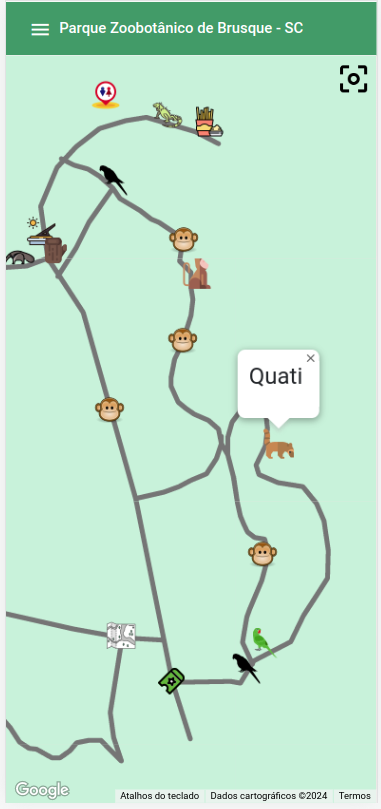
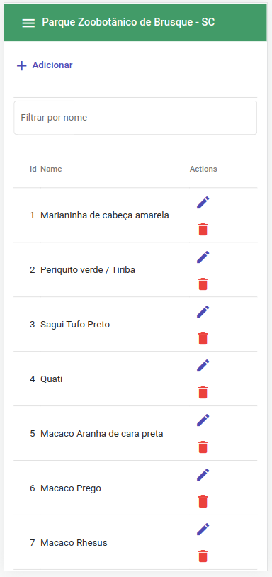
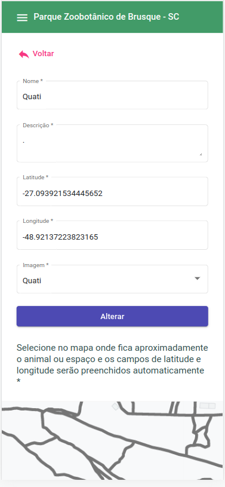

# Map Zoo Brusque

This project was generated with [Angular CLI](https://github.com/angular/angular-cli) version 14.2.6 with node 16.10.0.

## Backend

Link for [backend](https://github.com/luis-olivetti/map-zoo-brusque-back) project.

## How to run

Enter a valid Google key for Google Maps to work:

**environments.ts** file: `googleMapsKey='YOUR_KEY'`

Run this command to install this project's dependencies:

```bash
$ npm install
```

Run the following command to start json-server and angular project:

```bash
$ npm start
```

## How to works

When starting the project, the map will display the Zoobotanical region of Brusque - SC with some markers indicating the locations of the animals and other points.

<p align="center">
  
</p>

In the top-left corner of the side menu, there is an option called `Marcadores` that navigates the website to a page with all registered markers, where you can **add**, **edit**, and **delete** records.

<p align="center">
  
</p>

Clicking on `Adicionar` or editing (using the pencil icon) will navigate the website to a page where the operation can be performed.

<p align="center">
  
</p>

This is it!
